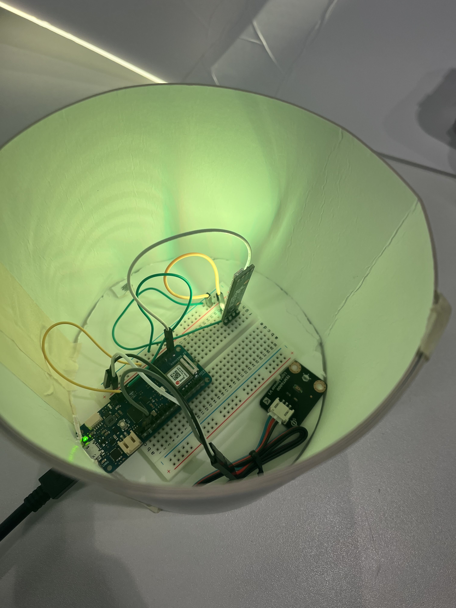

# Chrono Lumina Sun x Moon Lamp

## What is my project?
Based on the assessment brief my Chrono Lumina interface uses a light sensor as the interactive controller to dynamically change the colour of my LED. In addition, I have also added a separate LED within a cyclinder enclosure to serve as a steady consistent lamp to compliment my interactive Chrono Lumina. 

## How does it work?
My Chrono Lumina "Sun and Moon" is a very simple project that uses a light sensor to change the colour of my Chrono Lumina depending on how bright or dark it is outside. The sensor I use is the Gravity: Analog Ambient Light Sensor TEMT6000, which detetcts how much light intensity there is and sends this value as a voltage signal to my arduino. It has an illumantion range between 1-1000 lux and therefore for my project any voltage signal above 500 will turn my Chrono Lumina Yellow to signify that it is daytime and anything below will turn it white to signify that it is nightime. The colour of the LED within the enclosure and my Chrono Lumina will both simulatenously change colours. 

### Initial Design Inspiration 

After I had managed to get my light sensor working and printing values I realised that I simply had an Arduino and a sensor and nothing else. I thought that was quite plain and wanted to add something else to liven it up. However, I did not want to go overboard and add too many things to the point where it did not really make any sense. Therefore, I decided to go with an Adafruit Neopixel LED to mimic what the Chrono Lumina was doing but without needing the MQTT. The name Sun X Moon I took inspiration from the Pokemon game with the same name. This is because it reminded me how the game is centred around the sun and moon, muchn like how my chrono lumina is centred around daytime and nighttime. In terms of what inspired my enclosure design, the large number of Chrono Luminas within the Classroom reminded me of sky lanterns(pictured below). Moreover, all the Chrono Lumina's can be controlled at once and the gentle glow of the LED's through the enclosure reminded me of sky lanterns all being lit at once. 
. 
Therefore, I decided to go with a cyclinder shape that looked like a sky lantern which I designed using paper and cardboard. 

I used a roll of tape I found in the lab closets to draw a circle and luckily it happened to be bigger than my breadboard. Therefore, my breadboard fit perfectly within the enclosure depsite my lack of measuring. As pictured below here's an example of day time with the breadboard inside.

## Chrono Lumina Sun x Moon Lamp Final Prototype

For my final prototpye this design I cut a hole out at the top so the neopixel led could glow through giving it that lantern effect. I also moved my light sensor to the top and slightly to the side. The reason for this was to prevent false readings based on the light intensity of the neopixel led. Additionally, the light sensor being placed at the top and taped down gave it an unobstructed view to get the most accurate readings. 

### Lessons learnt from the Chrono Lumina Prototyping
Throughout the quick development and prototyping of my Chrono Lumina Sun x Moon, I have learnt some important things that I'll take into second semester. 

-Manage time between different projects better:
I had a separate project from a different module and I did not pour as much time into this as I wanted.

-It's okay to reusue sketches:
I simply reusued my neopixel LED code from the previous project which helped me save time.

-No need to overcomplicate things:
I intitially though I would have to write a string for the light sensor to then change the colour of the LEDs, however I could just set it so the sprintf function had separate mqtts with specific colours. Then I could simply use them to trigger the Chrono Lumina based off the sensor code that I wrote.

-Draw more sketches:
I started making the cyclinder enclosure literally based off the image of a cyclinder in my head. I did not draw multiple sketches where I could have perhaps explored different shapes and approaches.

. 

 ### References

 skylamp (no date). Available at: https://www.freepik.com/free-vector/gradient-lantern-festival-background_21665748.htm#fromView=keyword&page=1&position=0&uuid=9ec4c0e5-4f80-414e-a537-e2b3975c8f10.

 Sample Code for Sensor Provided by Manufacturer: https://wiki.dfrobot.com/TEMT6000_ambient_light_sensor_SKU_SEN0043#target_4

 