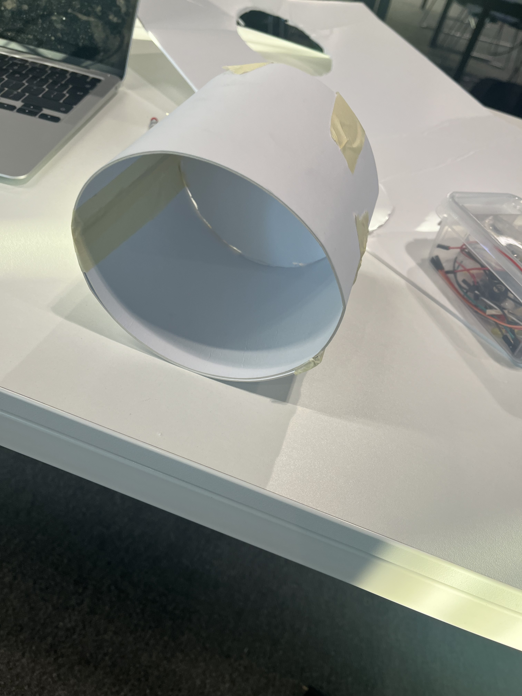
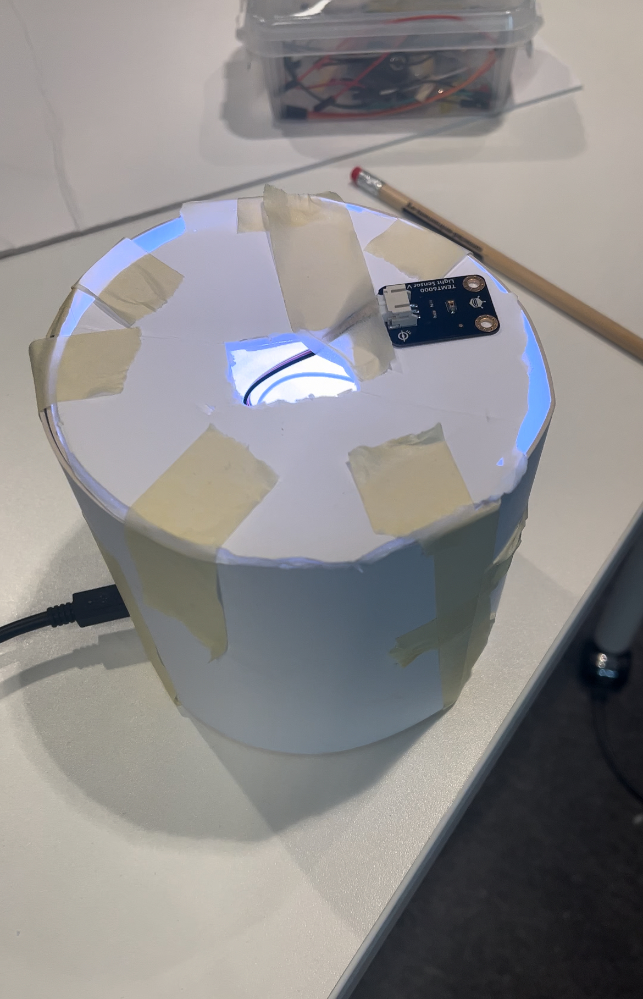

# Chrono Lumina Sun x Moon Lamp

## What is my project?
Based on the assessment brief my Chrono Lumina interface uses a light sensor as the interactive controller to dynamically change the colour of my LED. In addition, I have also added a separate LED within a cyclinder enclosure to serve as a steady consistent lamp to compliment my interactive Chrono Lumina. 

## How does it work?
My Chrono Lumina "Sun and Moon" is a very simple project that uses a light sensor to change the colour of my Chrono Lumina depending on how bright or dark it is outside. The sensor I use is the Gravity: Analog Ambient Light Sensor TEMT6000, which detetcts how much light intensity there is and sends this value as a voltage signal to my arduino. It has an illumantion range between 1-1000 lux and therefore for my project any voltage signal above 500 will turn my Chrono Lumina Yellow to signify that it is daytime and anything below will turn it white to signify that it is nightime. The colour of the LED within the enclosure and my Chrono Lumina will both simulatenously change colours. 

### Initial Design Inspiration 

After I had managed to get my light sensor working and printing values I realised that I simply had an Arduino and a sensor and nothing else. I thought that was quite plain and wanted to add something else to liven it up. However, I did not want to go overboard and add too many things to the point where it did not really make any sense. Therefore, I decided to go with an Adafruit Neopixel LED to mimic what the Chrono Lumina was doing but without needing the MQTT. In terms of what inspired my enclosure design, the large number of Chrono Luminas within the Classroom reminded me of sky lanterns.(as pictured below) .
Therefore, I decided to go with a cyclinder shape that looked like a sky lantern which I designed using paper and cardboard. 

## Chrono Lumina Sun x Moon Lamp Final Prototype

 